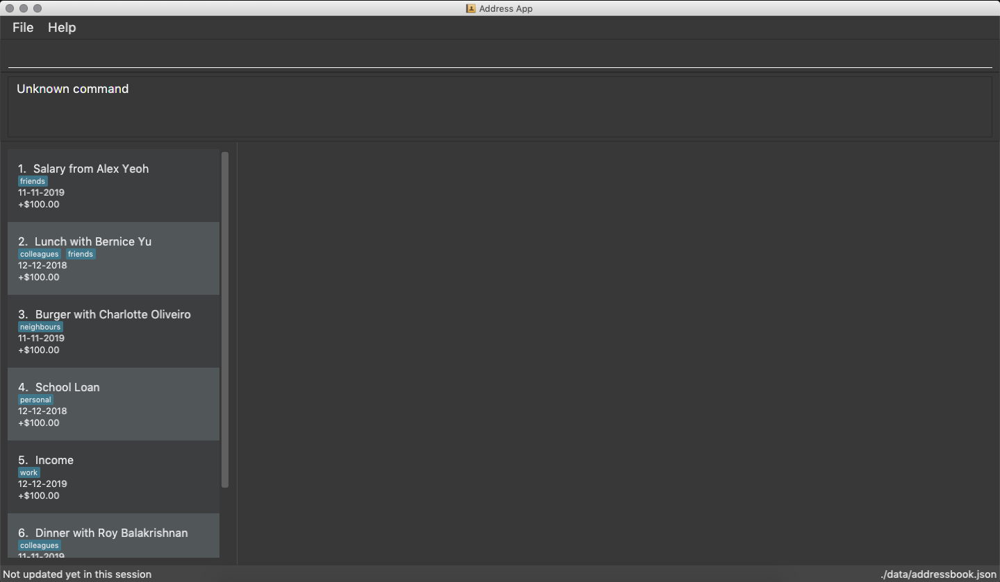

= Budgeter
ifdef::env-github,env-browser[:relfileprefix: docs/]

https://travis-ci.org/cs2113-ay1819s2-t11-3/main[image:https://travis-ci.org/cs2113-ay1819s2-t11-3/main.svg?branch=master[Build Status]]
https://ci.appveyor.com/project/damithc/addressbook-level4[image:https://ci.appveyor.com/api/projects/status/3boko2x2vr5cc3w2?svg=true[Build status]]
https://coveralls.io/github/se-edu/addressbook-level4?branch=master[image:https://coveralls.io/repos/github/se-edu/addressbook-level4/badge.svg?branch=master[Coverage Status]]
https://www.codacy.com/app/damith/addressbook-level4?utm_source=github.com&utm_medium=referral&utm_content=se-edu/addressbook-level4&utm_campaign=Badge_Grade[image:https://api.codacy.com/project/badge/Grade/fc0b7775cf7f4fdeaf08776f3d8e364a[Codacy Badge]]

ifdef::env-github[]

endif::[]

ifndef::env-github[]
image::images/Ui.png[width="600"]
endif::[]

* This is a desktop Financial Planner application. It has a GUI but most of the user interactions happen using a CLI (Command Line Interface).

*This app is mainly for users who want to:*

* Understand and reconcile their financial entries to make better financial decisions
* Organise their financial information using mostly CLI
* Have a visual representation of their financial data
* Store and retrieve their financial data efficiently

*This app is mainly written in an OOP fashion.* +

*What’s good about this project:*

* The app has a sophisticated GUI that includes a list panel, a table panel and also report panels

* The app has the ability to show detailed visual representations of the financial spendings and income data stored in the application.

* The app has suggestive command UI built in to aid in the typing.

* Contains many test cases, including automated GUI testing.

* Supports for Build Automation using Gradle and for Continuous Integration using Travis CI.

== Site Map

* <<UserGuide#, User Guide>>
* <<DeveloperGuide#, Developer Guide>>
* <<LearningOutcomes#, Learning Outcomes>>
* <<AboutUs#, About Us>>
* <<ContactUs#, Contact Us>>

== Acknowledgements

* Some parts of this sample application were inspired by the excellent http://code.makery.ch/library/javafx-8-tutorial/[Java FX tutorial] by
_Marco Jakob_.
* This application is modified from AddressBook-Level4 project created by SE-EDU initiative at https://github.com/se-edu/
* Libraries used: https://github.com/TestFX/TestFX[TextFX], https://github.com/FasterXML/jackson[Jackson], https://github.com/google/guava[Guava], https://github.com/junit-team/junit5[JUnit5]

== Licence : link:LICENSE[MIT]
